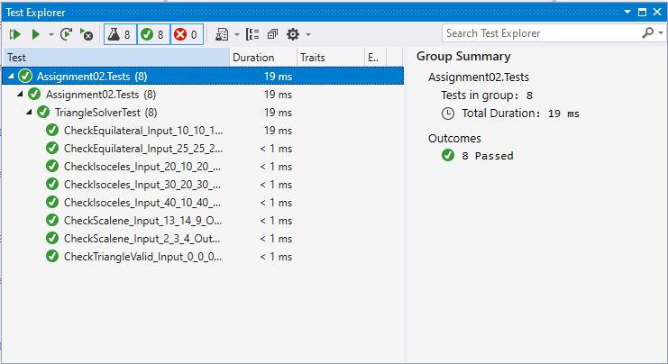
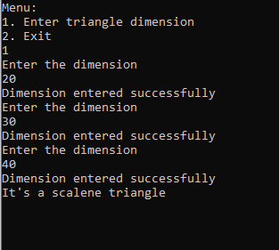
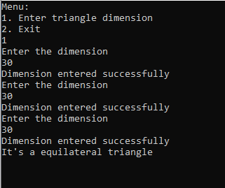

# TriangleSQA
C# console application that first presents the user with the following menu:  
1.Enter triangle dimensions 
2.Exit 
 
If any incorrect input is given, the menu is shown again. Your program should never crash.  
The exit option quits the program, and is the only way to exit the program (other than closing the window).  
If the user selects the first option, the program asks the user to enter three integers. The program will use these three numbers and report back to the user if the numbers:  
A.Form a triangle or not. 
B.If the numbers do form a triangle, the program reports if that triangle is scalene, isosceles, or equilateral.  
<b>Screenshots:</b> 
<b>1. Test Cases</b> 
  
<b>2.</b> 
  
<b>3.</b> 

